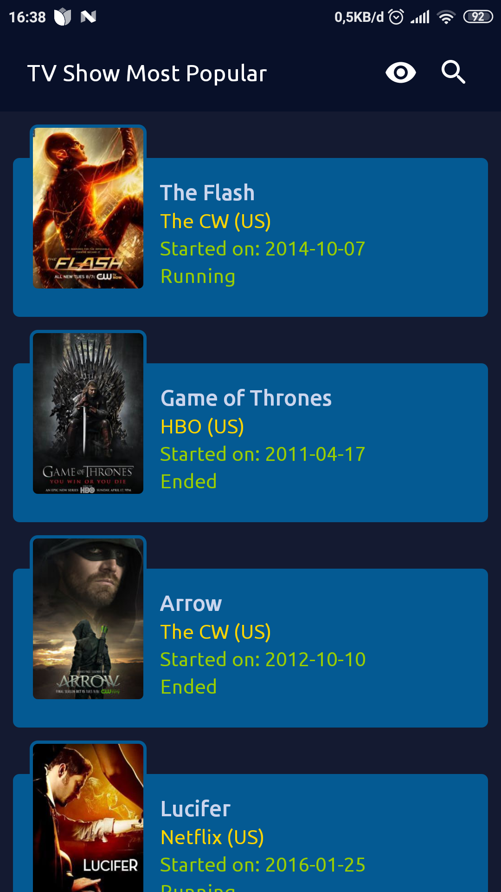
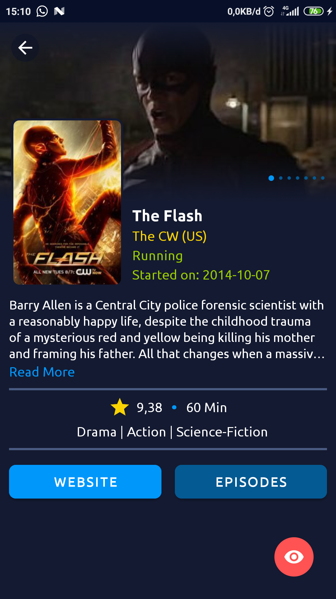
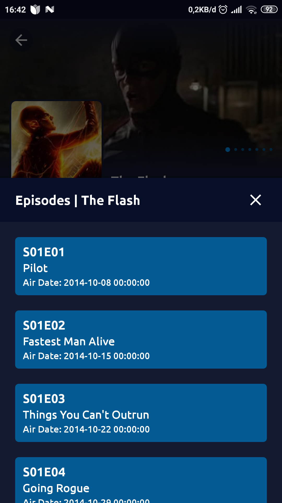
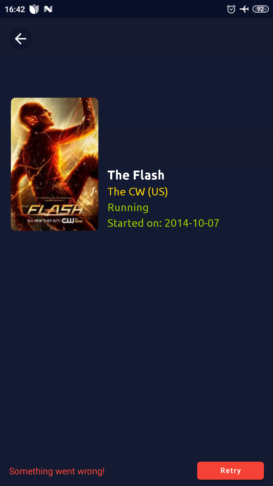
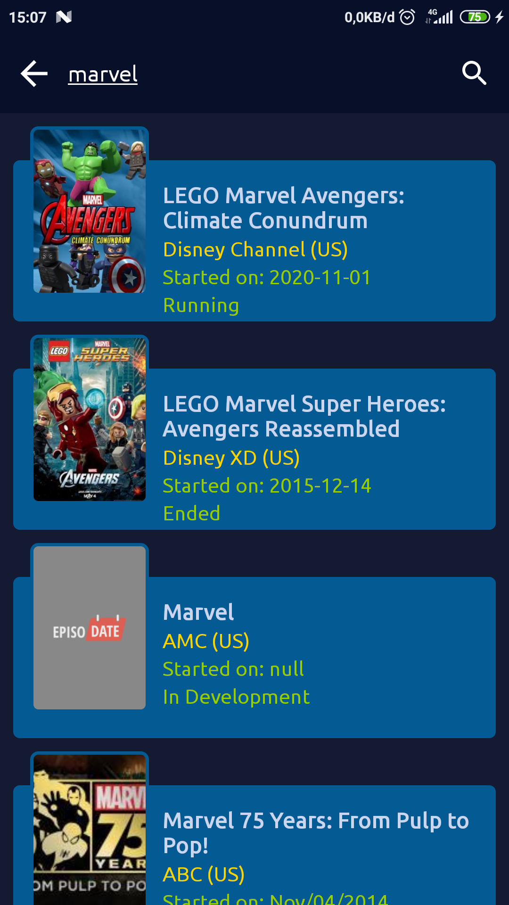
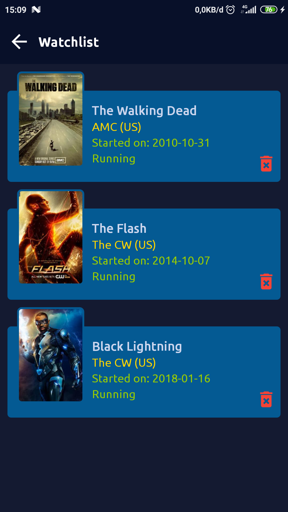

## TVShowApp

Simple TV Show App

## Features
- MVVM Design Pattern
- Android Java
- Room Database
- Get data from API ([www.episodate.com](https://www.episodate.com/api))

## Screenshots

    
    
    

    
    
    

